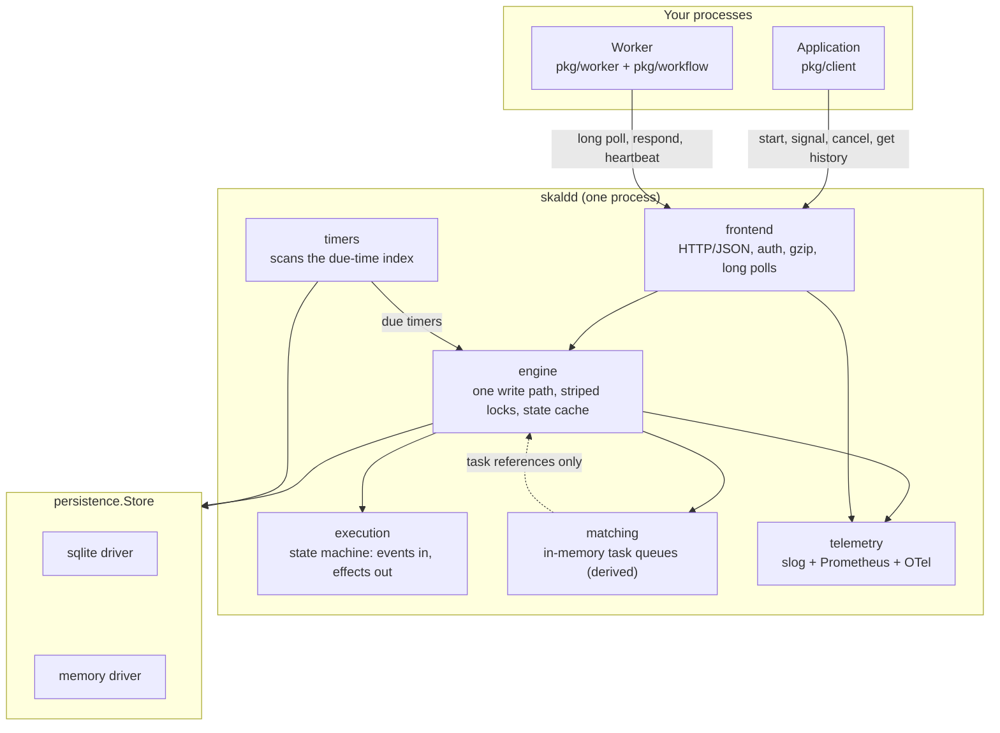

# Skald

Skald is a durable workflow execution engine for Go: you write an ordinary
function, and the engine guarantees it runs to completion across process
crashes, deploys and multi-day waits, replaying it from an append-only event
history instead of asking you to build your own state machine.

[](https://github.com/skald-io/skald/actions/workflows/ci.yml)
[](https://goreportcard.com/report/github.com/skald-io/skald)
[](https://codecov.io/gh/skald-io/skald)
[](LICENSE)
[](go.mod)

## The problem

A customer places an order. Your handler charges the card, reserves inventory,
waits 24 hours for the fraud check, then ships. Four steps, three of which talk
to a system that can fail, and one of which takes a day.

The machine running that handler is restarted between the charge and the
reservation — a deploy, an OOM kill, a spot instance reclaimed. What is the
state of the world? The card is charged. Nothing recorded that fact anywhere
your code can find it. The customer's money is gone and no inventory is
reserved, and nothing in the system will ever notice, because the goroutine
that knew about the order died with the process.

The usual answers are a status column and a cron job that re-drives stuck rows,
or a queue per step with a message shape per transition. Both work. Both mean
the business logic is smeared across a state machine you maintain by hand, and
both make "what actually happened to order 1234" a question you answer by
joining three tables against a log.

Skald's answer is that the function is the state machine. Every effect a
workflow has on the outside world is preceded by an event recording the intent
and followed by an event recording the outcome, in an append-only history that
is the only durable truth. When the process dies, another worker replays the
history, the code arrives back at the exact line it was on, and the charge is
not re-issued, because the history already says it happened.

```go
func FulfilOrder(ctx workflow.Context, o Order) (string, error) {
    var chargeID string
    if err := workflow.GetResult(ctx, workflow.ExecuteActivity(ctx, ChargeCard, o), &chargeID); err != nil {
        return "", err
    }
    if err := workflow.Sleep(ctx, 24*time.Hour); err != nil { // durable; no process holds this
        return "", err
    }
    return chargeID, workflow.Wait(ctx, workflow.ExecuteActivity(ctx, ShipOrder, o, chargeID))
}
```

That function survives every process in the system dying at any instruction.

## 60-second quickstart

Requires Go 1.23 or later.

```bash
go install github.com/skald-io/skald/cmd/skaldd@latest
go install github.com/skald-io/skald/cmd/skaldctl@latest

# The in-memory store is the default and loses everything on restart.
# Use SQLite for anything you care about.
skaldd --store sqlite --sqlite-path ./skald.db
```

Then, in a module of your own (`go get github.com/skald-io/skald`):

```go
package main

import (
	"context"
	"log"
	"time"

	"github.com/skald-io/skald/pkg/client"
	"github.com/skald-io/skald/pkg/worker"
	"github.com/skald-io/skald/pkg/workflow"
)

type Order struct {
	ID     string `json:"id"`
	Amount int64  `json:"amount_cents"`
}

// Activities are ordinary Go. They may fail; the engine retries them.
func ChargeCard(ctx context.Context, o Order) (string, error) {
	return "ch_" + o.ID, nil
}

func ShipOrder(ctx context.Context, o Order, chargeID string) error { return nil }

// A workflow is deterministic code. Skald replays it from its history after a
// crash, so it resumes exactly where it stopped.
func FulfilOrder(ctx workflow.Context, o Order) (string, error) {
	ctx = workflow.WithActivityOptions(ctx, workflow.ActivityOptions{
		StartToCloseTimeout: 30 * time.Second,
	})

	var chargeID string
	if err := workflow.GetResult(ctx, workflow.ExecuteActivity(ctx, ChargeCard, o), &chargeID); err != nil {
		return "", err
	}

	// A durable sleep: it lives in the store, not in this process.
	if err := workflow.Sleep(ctx, 24*time.Hour); err != nil {
		return "", err
	}

	if err := workflow.Wait(ctx, workflow.ExecuteActivity(ctx, ShipOrder, o, chargeID)); err != nil {
		return "", err
	}
	return chargeID, nil
}

func main() {
	ctx := context.Background()

	c, err := client.New("http://127.0.0.1:7233")
	if err != nil {
		log.Fatal(err)
	}
	defer c.Close()

	w := worker.New(c, "orders", worker.Options{})
	w.RegisterWorkflow(FulfilOrder)
	w.RegisterActivity(ChargeCard)
	w.RegisterActivity(ShipOrder)
	if err := w.Start(); err != nil {
		log.Fatal(err)
	}
	defer w.Stop(ctx)

	// The workflow ID is a natural key: starting "order-1234" again while the
	// first run is open is refused, not duplicated.
	h, err := c.ExecuteWorkflow(ctx, client.WorkflowOptions{
		ID:        "order-1234",
		Type:      "FulfilOrder",
		TaskQueue: "orders",
	}, Order{ID: "1234", Amount: 4200})
	if err != nil {
		log.Fatal(err)
	}

	var chargeID string
	if err := h.Result(ctx, &chargeID); err != nil {
		log.Fatal(err)
	}
	log.Printf("run %s charged %s", h.RunID(), chargeID)
}
```

Kill the process at any point and start it again: the workflow picks up where it
left off, and `ChargeCard` does not run twice.

While it waits, inspect it:

```bash
skaldctl workflow describe order-1234
skaldctl workflow history order-1234
skaldctl workflow list --status RUNNING
```

Runnable programs live in [`examples/`](examples/).

## Architecture



The one thing worth internalising from that picture: **the arrow from `matching`
into the store does not exist.** Task queues hold references, not payloads, and
they are never persisted. The history is the only durable truth; every pending
task is reconstructible from it, which is what the startup recovery scan does.
See [ADR 0004](docs/adr/0004-derived-task-queues.md).

The lifecycle of one workflow task, end to end, is in
[docs/ARCHITECTURE.md](docs/ARCHITECTURE.md).

## Features

| Capability | Status | Notes |
| --- | --- | --- |
| Durable workflow execution with replay | Yes | Full history is sent on every task; sticky cache is an optimisation only |
| Activities with retries and backoff | Yes | Exponential, jittered, jitter seed recorded in history so replay agrees |
| Four independent timeout clocks | Yes | schedule-to-start, start-to-close, schedule-to-close, heartbeat |
| Heartbeats with checkpoints | Yes | Checkpoint is handed to the next attempt; no history event per beat |
| Durable timers | Yes | Live in the store's due-time index, not in a runtime timer wheel |
| Signals | Yes | Durable on arrival; buffered per name; delivered to a workflow channel |
| Signal-with-start | Yes | One transaction, so two racing callers cannot both start |
| Cooperative cancellation | Yes | Workflow observes the request and decides how to unwind |
| Terminate | Yes | Closes the execution without running workflow code |
| Continue-as-new | Yes | Successor run with a fresh history; chain is walkable via `first_execution_run_id` |
| Workflow-level retry | Yes | A failed run's successor is created with a deferred first task |
| Side effects and mutable side effects | Yes | Recorded as markers; mutable variant records only on change |
| Local activities | Yes | Run inline in the workflow task; single attempt, recorded as a marker |
| Versioning gate (`GetVersion`) | Yes | The chosen branch is recorded, so in-flight runs are pinned |
| Deterministic randomness and UUIDs | Yes | Two independent streams from one seed drawn by the server |
| Workflow ID reuse policies | Yes | allow-duplicate, failed-only, reject, terminate-if-running |
| Idempotent starts | Yes | `request_id` deduplicates a retried start at the store |
| Offline history replay (CI check) | Yes | `worker.Replayer`, plus `skaldctl workflow replay` for structural validation |
| Namespaces | Partial | Every request is namespaced and queues are partitioned; there is no namespace registry or per-namespace configuration |
| Visibility / list | Partial | Exact-match filters on workflow ID, type and status with keyset pagination; no query language, no index on memo or search attributes |
| Pluggable storage | Yes | `persistence.Store` with memory and SQLite drivers and a shared conformance suite |
| Metrics, traces, structured logs | Yes | Prometheus at `/metrics`, OTel spans (no exporter configured by default), slog |
| Operator CLI | Yes | `skaldctl` with human and `--output json` rendering |

## What Skald is not

This section is deliberately specific. Everything below is a property of the
code as it stands, not a roadmap.

**It is a single-node engine.** The write path is designed for more than one
replica — every write is a compare-and-set on a version the caller read, and
the per-execution lock is explicitly a latency optimisation and not a
correctness mechanism — but nothing you can deploy today uses that. The two
shipped drivers are an in-memory map and a single SQLite file, and the matching
layer is process-local: a task dispatched inside one `skaldd` can only be polled
from that same `skaldd`. Run one. Scaling out means writing a `persistence.Store`
for a networked database *and* giving matching a cross-process story.

**There are no child workflows.** Event codes 100–119 are reserved and
deliberately unassigned so the eventual implementation does not have to
renumber anything, but no command, event or API exists today. Compose with
`ExecuteActivity` that starts another workflow through the client, and accept
that the parent then has no built-in link to the child.

**There is no cron scheduling.** `CronSchedule` is accepted by
`StartWorkflow`, written into event 1, and carried faithfully through retries
and continue-as-new — and then nothing reads it. No cron expression parser
exists and no run is ever scheduled from it. Use an external scheduler that
calls `StartWorkflow`.

**There are no queries and no updates.** A running workflow's internal state
can be observed only through its history and through signals it chooses to
answer. `pkg/api` has no query or update operation.

**A workflow cannot signal or cancel another workflow from inside itself.**
`skald.UnknownExternalWorkflowError` is declared in the public vocabulary and is
currently unused: there is no corresponding command type.

**An activity's live attempt number is not in the history.** A retry writes no
history event, on purpose — an activity retried a thousand times still
contributes two events. The consequence is that `ActivityTaskStarted.Attempt`
reads `1` forever, and the real attempt counter between attempts lives in the
`ActivityRetry` row of the durable timer index. That row is the durable
statement "attempt N is due at T and has not started", and the engine trusts it
over the rebuilt state. It works, and it means the timer index is not purely a
performance cache: losing it loses the attempt counter.

**Creating a successor run is a second transaction.** Closing a run
(continue-as-new, or a workflow-level retry) commits first; creating its
successor is a separate `CreateExecution`. A process that dies in between leaves
a chain with a dangling link. The successor's request ID is derived from the
predecessor's run ID, so a repeat attempt is collapsed by the store rather than
producing two runs — but nothing retries it automatically. Closing the window
needs a store primitive that closes one run and opens another atomically, which
`persistence.Store` deliberately does not have.

**Workflow task ownership is checked by identity, not by token.**
`RespondWorkflowTaskCompleted` carries no started-event ID, so when a task times
out and a replacement is started elsewhere, the only discriminator against the
original worker's late response is the identity recorded on the started event.
Two workers sharing an identity defeat the check. It is defence in depth, not a
guarantee.

**The history length limit bites late.** `history.MaxHistoryEvents` is 50,000
and is enforced by `History.Validate`, which runs on rebuild — not on append. A
run that exceeds it keeps working while its state is cached and then becomes
unloadable, surfacing as an internal error on the next cache miss. Call
`ContinueAsNew` well before that. `history.MaxHistoryBytes` (64 MiB) is
declared but never enforced anywhere.

**`WorkflowTaskFailedCauseResourceExhausted` is never produced.** The cause code
exists in the vocabulary; nothing in the engine or the worker emits it.

**Local activities do not retry.** `ExecuteLocalActivity` runs the function
once, records the result or the failure as a marker, and returns. There is no
retry policy, and `LocalActivityOptions.ScheduleToCloseTimeout` is advisory —
the workflow task timeout is the real bound.

**There is no TLS and no authorization.** `skaldd` serves plain HTTP. The only
authentication is a single static bearer token shared by every caller; it
answers "may you talk to this server" and nothing else. There is no per-caller
identity, no per-namespace access control, and no TLS listener — terminate TLS
at a proxy and keep the server on an interface you trust. The default bind
address is `127.0.0.1:7233` for exactly this reason.

**Nothing is ever deleted.** There is no retention policy, no archival and no
delete operation on `persistence.Store`. Closed executions and their histories
accumulate until you remove them yourself.

**SQLite's default durability is `synchronous=NORMAL` in WAL mode.** A process
crash, a `kill -9` or an OOM loses nothing. A power cut or a kernel panic can
lose the last few committed transactions. That is an honest trade — Skald
acknowledges a start only after commit returns — but if your operating
environment includes sudden power loss, set `synchronous=FULL` and pay for it.

## How this compares to Temporal and Cadence

Skald is a from-scratch implementation of the ideas those systems pioneered,
built at a size a single engineer can read in an afternoon. It is not a
competitor to them and should not be chosen over them for a production workload
that needs what they provide.

The concepts are deliberately the same, because they are the right ones and
because a reader who knows one should be able to read the other: an append-only
history as the only truth, a workflow task as the unit of workflow-code
execution, commands as the only channel from workflow code to the world,
replay-based recovery, activities with four timeout clocks, markers for side
effects, and a versioning gate that pins in-flight executions to the branch they
started on. Where a name or a semantic could reasonably match Temporal's, it
does.

What Temporal and Cadence give you that Skald does not: horizontal scale across
many nodes with sharded history services, child workflows, schedules, queries
and updates, a search index over workflow attributes, multi-language SDKs,
namespace management and access control, archival and retention, and a decade
of production hardening across a very large number of deployments. If you are
choosing an engine to run your company's payments on, choose one of those.

What Skald offers instead is a complete, honest implementation of the same
model in roughly 37,000 lines of Go, with the design decisions written down as
[ADRs](docs/adr/) and the trade-offs stated where they are made rather than
discovered later. It is useful as a small durable execution engine for a
single-node deployment, and it is useful as something to read.

## Documentation

| Document | What is in it |
| --- | --- |
| [docs/ARCHITECTURE.md](docs/ARCHITECTURE.md) | The event model, the workflow-task lifecycle, determinism and replay, the command protocol, retries and timeouts, the concurrency model, recovery, failure modes |
| [docs/writing-workflows.md](docs/writing-workflows.md) | Authoring guide: determinism rules, the versioning gate with a worked example, testing, common mistakes |
| [docs/protocol.md](docs/protocol.md) | The wire protocol: every endpoint, every request and response shape, status and error-code mapping, long-poll semantics, idempotency, versioning |
| [docs/operations.md](docs/operations.md) | Runbook: deployment topologies, every flag and environment variable, metrics and alerts, diagnosing a stuck workflow, non-determinism incidents, backup and restore, capacity |
| [docs/benchmarks.md](docs/benchmarks.md) | Measured throughput and latency, and what the numbers mean |
| [docs/adr/](docs/adr/) | Architecture decision records, Nygard format, one per real decision |
| [CONTRIBUTING.md](CONTRIBUTING.md) | Development setup, tests, commit conventions, review expectations |
| [SECURITY.md](SECURITY.md) | Supported versions and private disclosure |

## Project layout

```
skald/
├── cmd/
│   ├── skaldd/               the server: config resolution, wiring, shutdown
│   └── skaldctl/             the operator CLI: start, describe, history, list, replay
├── pkg/                      the public API surface
│   ├── skald/                shared vocabulary: IDs, payloads, errors, retry policy, status
│   ├── history/              the event model: event types, attributes, commands, validation
│   ├── api/                  the wire protocol: request/response types, error codes, paths
│   ├── client/               HTTP client implementing api.Service, plus WorkflowHandle
│   ├── worker/               worker runtime: registry, pollers, activity host, Replayer
│   └── workflow/             the workflow authoring API: typed skin over internal/workflow
├── internal/
│   ├── execution/            the state machine: MutableState, transitions, effects
│   ├── engine/               api.Service on the store: the single write path
│   ├── persistence/          the storage contract, plus memory/ and sqlite/ drivers
│   │   └── persistencetest/  the conformance suite every driver must pass
│   ├── matching/             derived, in-memory task queues with sync and async matching
│   ├── timers/               the scanner that turns the due-time index into callbacks
│   ├── clock/                real and virtual clocks; the reason the test suite is fast
│   ├── workflow/             the replay machinery: dispatcher, coroutines, executor
│   ├── frontend/             HTTP/JSON transport: routing, auth, gzip, long polls
│   ├── telemetry/            logs, metrics and traces wired into one value
│   └── simulation/           deterministic simulation harness
├── test/integration/         end-to-end tests against a running server
├── examples/                 runnable programs
├── deploy/                   Prometheus and Grafana provisioning for docker-compose
└── docs/                     everything in the table above
```

## How to read this codebase

Five files, in this order. Each one only depends on the ones before it.

1. **`pkg/history/eventtype.go`** and **`pkg/history/attributes.go`** — the
   vocabulary. Every fact Skald can record about a workflow is one of these
   twenty-five event types. Read the type list, then read
   `WorkflowExecutionStartedAttributes` and `ActivityTaskScheduledAttributes`.
   Everything else in the system exists to produce or consume these.

2. **`internal/execution/mutablestate.go`** — the state machine. `apply` is the
   whole of it: a pure function from (state, event) to state, with no I/O, no
   clock read and no randomness. `Rebuild` is the same function in a loop, which
   is why the replay path is exercised on every single request rather than only
   during recovery.

3. **`internal/engine/engine.go`** — the write path, and the package comment
   above it. Read the five numbered steps, then read `mutate`, `commit` and
   `desiredTimers`. Once you understand why effects are applied *after* the
   commit, you understand the engine's central safety argument.

4. **`internal/workflow/dispatcher.go`** — the cooperative scheduler, and its
   package comment in `internal/workflow/doc.go`. This is why ordinary-looking
   Go with goroutines and selects can be deterministic. Pay attention to the
   four kinds of progress and to why case 4 is load-bearing.

5. **`internal/workflow/replayer.go`** — `ProcessTask` and `matchCommand`. This
   is where replay meets history: a queue of commands the workflow produced,
   matched one by one against the events the history recorded, with a diagnostic
   for every way they can disagree.

After that, `internal/frontend/server.go` and `internal/persistence/store.go`
are self-contained, and `pkg/worker/worker.go` ties the whole thing together.

## Development

```bash
make help          # every target, with a one-line description
make ci            # what CI runs: fmt, vet, lint, race tests, build
make test          # unit tests
make test-race     # unit tests under the race detector
make cover         # coverage profile and summary
make docker        # build the container image
```

## License

Apache 2.0. See [LICENSE](LICENSE).
