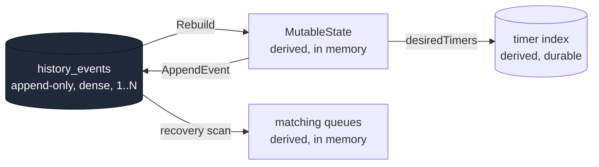
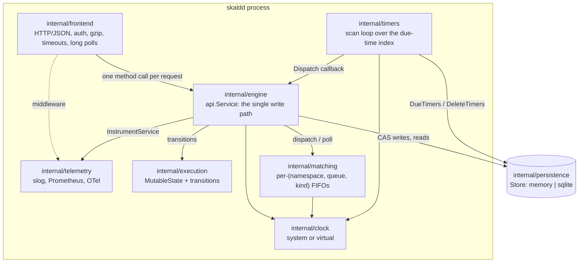
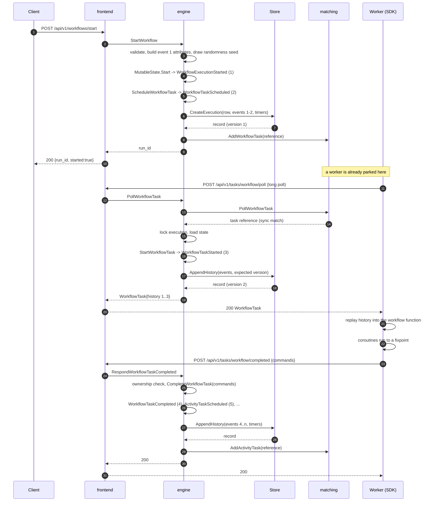
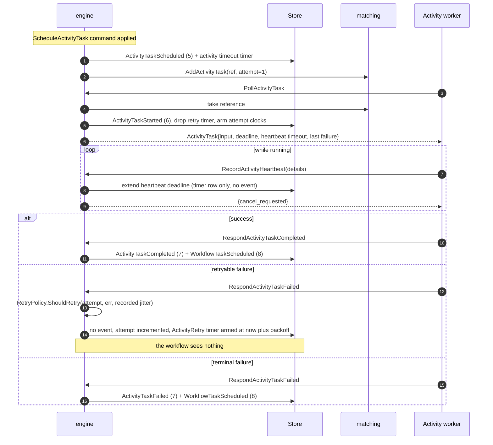
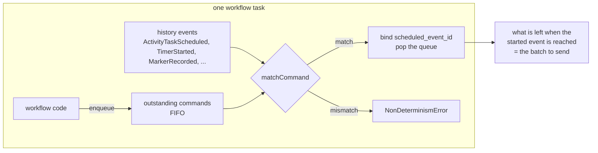

# Skald architecture

This document describes how Skald actually works: the durability model, the
lifecycle of a workflow task, how determinism is enforced, and what happens when
each part fails. It is written for someone who is going to change the code.

Package documentation is the other half of this. Where a decision is local to
one package, the package comment states it and this document points at it rather
than restating it.

## Contents

- [Vocabulary](#vocabulary)
- [The durability model](#the-durability-model)
- [Components](#components)
- [The workflow-task lifecycle](#the-workflow-task-lifecycle)
- [Determinism and replay](#determinism-and-replay)
- [The command protocol](#the-command-protocol)
- [Retries and the four timeout clocks](#retries-and-the-four-timeout-clocks)
- [The concurrency model](#the-concurrency-model)
- [Derived task queues and recovery](#derived-task-queues-and-recovery)
- [Failure modes](#failure-modes)
- [Known limitations](#known-limitations-and-what-it-would-take-to-fix-them)

## Vocabulary

| Term | Meaning in the code |
| --- | --- |
| **Workflow** | A registered Go function `func(workflow.Context, ...) (T, error)` |
| **Execution** | One logical workflow, addressed by `(namespace, workflow_id)` |
| **Run** | One physical attempt at an execution, addressed by `run_id`; retries and continue-as-new produce new runs of the same execution |
| **History** | The append-only, dense, 1-based sequence of events for one run — the only durable truth |
| **Mutable state** | `execution.MutableState`, the derived in-memory view of a run, rebuilt by replaying its history |
| **Workflow task** | One unit of workflow-code execution: "here is the history, tell me what to do next" |
| **Command** | A declarative instruction produced by workflow code (`ScheduleActivityTask`, `StartTimer`, ...) |
| **Activity task** | One attempt at one activity |
| **Effect** | Post-commit work the state machine asks the engine to do: dispatch a task, arm a timer, create a successor run |
| **Marker** | A history event recording a decision the workflow made locally: a side effect, a version gate, a local activity |

## The durability model

### History is the only truth

Everything else in Skald is derived. `MutableState` is a cache of the history.
The task queues are a cache of the history. The state cache in the engine is a
cache of a cache. Every one of them can be thrown away and rebuilt from
`history_events` with no loss of correctness — only of latency.

That is enforced structurally, not by convention:

- `execution.MutableState` has exactly one mutating entry point, `AppendEvent`.
  It stamps the next dense event ID and the current time, applies the event to
  the derived state, and only then records it. If `apply` rejects the
  transition, the history is left untouched, so a rejected operation cannot
  leave a half-written run behind.
- `apply` is a pure function of `(state, event)`. No I/O, no clock read, no
  randomness. `Rebuild` is that same function in a loop over a persisted
  history. Because both the hot path and the recovery path go through it, a bug
  in event application shows up on the next request instead of hiding until a
  failover.
- `persistence.Store.AppendHistory` writes the new events, the updated execution
  row and the timer-index changes in one transaction. There is no ordering in
  which a caller can observe events without the row that describes them.



The timer index is the one derived structure that is *durable*. It has to be:
"which timers are due in the next second" must be answerable in O(log n), and a
full scan of every open execution is O(open executions) — fine at a thousand,
fatal at ten million. It is also not purely a performance cache, because the
`ActivityRetry` entry carries the live attempt number of an activity between
attempts, which exists nowhere in the history. See
[Known limitations](#known-limitations-and-what-it-would-take-to-fix-them).

### Events are immutable and their codes are permanent

`pkg/history/eventtype.go` assigns numeric codes in blocks, with gaps left
deliberately. A code that has shipped is never reused for a different meaning,
because histories written years ago must still decode.

Decoding an unknown event type is a hard error, never a skipped event. A decoder
that ignores what it does not understand produces a mutable state that disagrees
with the one the writer had, which is strictly worse than refusing to run. The
same rule holds in the SDK: `Executor.apply` returns an error for an event type
the build does not know, rather than continuing.

`History.Validate` checks every structural invariant — dense 1-based IDs, event
1 is `WorkflowExecutionStarted`, non-decreasing timestamps, a terminal event
only in last position, and that every back-reference names an earlier event of
the right kind. It is cheap enough that `Rebuild` runs it on every load.

### Intent before effect

Every observable effect is bracketed by events:

```
ActivityTaskScheduled   <- the intent is durable before any worker sees it
ActivityTaskStarted     <- a worker took it
ActivityTaskCompleted   <- the outcome is durable
```

Replay therefore never re-issues an effect that already happened: the SDK sees
`ActivityTaskScheduled` in the history, matches it against the command the
workflow just produced, and resolves the future from `ActivityTaskCompleted`
instead of dispatching anything.

## Components



`api.Service` is implemented three times — by the engine, by the HTTP handler
and by the HTTP client — which is what lets a worker be pointed at an in-process
engine with no server at all. The test suite and single-binary deployments both
rely on that symmetry, and it means there is no second code path that only
production exercises.

`internal/frontend` contains no workflow logic. Every handler decodes one
request, calls one method of `api.Service`, and encodes the response. Its
package comment explains why long polls shape everything unusual about it.

## The workflow-task lifecycle

This is the central loop. Everything else is a variation on it.



Steps worth understanding:

**The task is scheduled, not dispatched, by the state machine.**
`ScheduleWorkflowTask` is idempotent: if a task is already outstanding it
returns no effect. Signals, activity completions and timer fires all want "make
sure the workflow gets a turn" and arrive concurrently; collapsing them into one
pending task is what stops a burst of ten signals from producing ten replays.

**Exactly one workflow task per execution is outstanding.** That single
constraint is what makes workflow code single-threaded from the author's point
of view, and it removes an entire class of concurrency bugs from user code.

**The worker receives the entire history.** Skald never sends a delta. Sticky
caching is an optimisation the SDK layers on top; correctness does not depend on
a cache being warm, and the test suite proves it by evicting between every task.

**Events appended while the worker was thinking become a new task.** Anything
between the started event and the completion — a signal, an activity result, a
timer fire — tried to wake the workflow, found a task already in flight, and
returned no effect. `RespondWorkflowTaskCompleted` notices the gap
(`NextEventID - StartedEventID > 1`) and schedules a fresh task. Without that,
a signal delivered mid-task would sit unread in the history.

**Effects are applied after the commit.** Never before. An engine that enqueues
a task before the write commits produces a duplicate every time the write fails,
and a duplicate activity execution is the exact failure durable execution exists
to prevent. Ordering it the other way can only *lose* a dispatch, and a lost
dispatch is recovered by the timer index or by the startup scan. One direction
of failure is a bug report; the other is a refund.

**Timers are the exception.** They are written inside the same store
transaction as the events that imply them, because a timer that exists only in
memory after the commit is a workflow that never wakes up.

### The activity lifecycle



A retry writes **no history event**. An activity retried a thousand times still
contributes two events, so a flaky dependency cannot blow past the history limit
or make replay expensive. The state machine leaves the activity pending, bumps
its attempt counter, clears `StartedEventID` and `RequestID`, and returns an
`ArmTimer` effect. The engine translates that into an `ActivityRetry` row in the
timer index carrying the attempt number, then re-dispatches when it fires.

## Determinism and replay

### The requirement

A workflow is replayed from event 1 on every workflow task. For that to produce
the same decisions it produced the first time, two properties must hold:

1. The code must be deterministic: given the same history it reaches the same
   instructions in the same order.
2. The code must not re-issue effects that already happened.

Ordinary Go defeats both. The runtime schedules goroutines non-deterministically,
`select` picks a random ready case, `time.Now` and `math/rand` differ on every
run, and a goroutine blocked on a channel cannot be told to stop.

### What is non-deterministic, and how each source is neutralised

| Source | How Skald neutralises it |
| --- | --- |
| Goroutine scheduling | `workflow.Go` creates a **coroutine** scheduled by `internal/workflow.Dispatcher`, not by the Go runtime. Exactly one of {dispatcher, coroutine} runs at any instant, enforced by a pair of unbuffered channels used as a hand-off. Coroutines run in creation order, which is a property of the code. |
| `select` picking at random | `workflow.Selector` runs the **first ready branch in registration order**. A selector expresses a priority, not a race. |
| Go channels | `workflow.Channel` is a dispatcher-aware channel: blocking on it yields to the dispatcher rather than parking on a runtime primitive, so the dispatcher always knows the complete set of runnable work. |
| `time.Now()` | `workflow.Now(ctx)` returns the timestamp of the workflow task being processed, taken from the history event. It never moves backwards. |
| `time.Sleep` | `workflow.Sleep` starts a durable timer: a `StartTimer` command, a `TimerStarted` event, a row in the due-time index, and a `TimerFired` event when it expires. |
| `math/rand` | `workflow.Rand(ctx)` is seeded from `RandomnessSeed`, drawn once by the server with `crypto/rand` and written into event 1. The generator is Skald's own splitmix64, not `math/rand`'s source, so a Go upgrade cannot change the numbers a six-month-old execution produces. |
| `uuid.New()` | `workflow.NewUUID(ctx)` draws from a **second** deterministic stream seeded from the same value XORed with a constant, so a workflow that starts using `Rand` in v2 does not shift the UUIDs v1 already handed to the outside world. |
| Map iteration order | Not neutralised — it cannot be. This is on the author. See the checklist in [docs/writing-workflows.md](writing-workflows.md). |
| Reading config, environment, the filesystem | `workflow.SideEffect` runs the function once, records the result as a `SideEffect` marker, and replays the recorded value forever after. |
| A value that legitimately changes over a long run | `workflow.MutableSideEffect` records a marker only when the value differs from the last one, so a flag polled once a minute for a month costs one marker per change. |
| Retry backoff jitter | The server draws the jitter once, records it in `ActivityTaskStarted.RetryJitterSeed`, and recomputes the delay from the recorded value. Randomness that is not written down is the most common source of non-determinism in workflow engines. |
| Log statements re-emitted on every replay | `workflow.GetLogger` wraps the handler in a `replayHandler` that drops every record while replaying. Without it a workflow on its fortieth task re-emits every line it ever produced, and — far worse — a log line stops being evidence that anything happened. |
| Deploying changed workflow code | `workflow.GetVersion` records the branch taken as a `Version` marker; every replay reads the recorded number. |

### The scheduling fixpoint

`Dispatcher.ExecuteUntilAllBlocked` repeats passes over its coroutines until a
pass makes no progress. "Progress" is marked by exactly four things:

1. a coroutine completes,
2. a coroutine is created,
3. a future settles or a channel operation moves a value,
4. a coroutine **enters a new blocking call**.

Case 4 is the subtle one and it is what makes the fixpoint correct. Consider
coroutine B awaiting a condition that coroutine A makes true, with B scheduled
first. Pass 1: B checks, false, yields. A runs, sets the flag, then blocks on an
activity — entering that blocking call marks progress, so a second pass happens
and B observes the flag. Without case 4 the dispatcher would stop one pass too
early and the workflow would stall.

Termination still holds: entering a *new* blocking call requires executing user
code, and a coroutine that merely re-checks the wait it is already parked on
marks nothing. A workflow that genuinely spins is caught by the deadlock
deadline and reported as a `DeadlockError` naming every blocked coroutine and
what it is waiting for.

### Non-determinism detection

The detector is one queue. Every command the workflow produces — whether during
replay of old history or in the live tail — lands in `env.outstanding`. Every
command-derived history event is matched against the head of that queue by
`Executor.matchCommand`.



Three ways it can disagree, each with its own diagnostic:

- **History has an effect the code did not ask for.** The queue is empty when an
  event arrives: the code has fewer steps than the code that wrote this history.
- **The head of the queue is the wrong command.** `commandMismatch` explains the
  specific disagreement — a different activity ID (which is a counter, so the
  number of activities scheduled before this point changed), a different
  activity type, a different timer duration, a different marker name.
- **The code produced commands the history never contains.** Detected at the end
  of an offline replay, when `outstanding` is non-empty.

Version gates, side effects and local activities can also raise
`NonDeterminismError` from inside workflow code. Because they must unwind user
frames, they travel as a panic and are unwrapped by `Executor.decorate` so the
caller sees the specific diagnosis rather than "panic".

The error message names the workflow type, the execution, the history event, the
position in the command batch, the expected effect, the actual command, the
workflow-side call that produced it, and the usual causes. That is deliberate: a
worker that says "non-determinism detected" and stops has told an operator
nothing.

### Refusing to advance

When a workflow task fails with `WorkflowTaskFailedCauseNonDeterminism`, Skald
appends a `WorkflowTaskFailed` event and **schedules the task again**. The
execution does not fail, does not time out and loses no data. It stays exactly
where it is until a worker build that agrees with the history picks it up.

Rolling back the offending deploy is therefore a complete fix. This is
[ADR 0008](adr/0008-refuse-to-advance-on-non-determinism.md).

The worker pauses `Options.FailedTaskBackoff` (100ms by default) after a failed
task, because the engine re-schedules immediately — correct, since a rollback
must be picked up at once — which without a pause would spin a core while the
revert is being deployed.

## The command protocol

Commands are the only channel through which a workflow affects the world. They
are declarative and idempotent by construction: the worker says "an activity
named X should run", never "run activity X now". The server decides whether that
intent is new (append a scheduling event) or already satisfied (an event that
exists), which is what makes replay safe.

| Command | Produces | Notes |
| --- | --- | --- |
| `ScheduleActivityTask` | `ActivityTaskScheduled` | Rejected without a schedule-to-close or start-to-close timeout |
| `RequestCancelActivityTask` | `ActivityTaskCancelRequested` | Names the scheduled event ID, which is stable across retries |
| `StartTimer` | `TimerStarted` | Duration must not be negative |
| `CancelTimer` | `TimerCanceled` | Names the started event ID |
| `RecordMarker` | `MarkerRecorded` | `SideEffect`, `Version`, `LocalActivity`, or any user-chosen name |
| `CompleteWorkflowExecution` | `WorkflowExecutionCompleted` | Closing |
| `FailWorkflowExecution` | `WorkflowExecutionFailed` | Closing; consults the workflow-level retry policy |
| `CancelWorkflowExecution` | `WorkflowExecutionCanceled` | Closing |
| `ContinueAsNewWorkflow` | `WorkflowExecutionContinuedAsNew` | Closing; names a successor run |

Batch rules, enforced by `history.ValidateBatch` and `MutableState.precheckCommands`:

- Each command carries exactly one populated attribute set matching its type.
- At most one closing command, and it must be last. A workflow that schedules
  work after deciding to finish has a bug the engine surfaces rather than papers
  over.
- No duplicate activity IDs or timer IDs, within the batch or against currently
  pending ones.
- A cancel must name something that is actually pending.

**The batch is all-or-nothing.** `CompleteWorkflowTask` validates and prechecks
before writing any event. Partial application would leave the workflow's
in-memory view — which already ran to the end of the batch — disagreeing with
the history, and that divergence is unrecoverable.

Every command-derived event carries `WorkflowTaskCompletedEventID`, a
back-reference to the task whose decision caused it. That is what makes a
history auditable: you can always find the decision that caused an effect, and
`History.Validate` enforces that the reference names a real, earlier
`WorkflowTaskCompleted`.

### Command production on the workflow side

`Environment.enqueue` appends to `outstanding`. Two subtleties:

- Once the workflow function returns, `env.closed` is set and further commands
  are **dropped**. A sibling coroutine still running may try to schedule work;
  the server rejects anything after a closing command, so dropping is the only
  behaviour that keeps the batch valid. This is not lost work — the execution is
  over.
- Cancelling something that has no history event yet (an activity scheduled
  earlier in the same batch) cannot name a scheduled event ID. Those
  cancellations are deferred to `pendingCancels` and flushed at the *top* of the
  next task, before any coroutine runs, so their position in the batch is fixed
  on every replay.

## Retries and the four timeout clocks

### Activity retries

`RetryPolicy.ShouldRetry(attempt, err, jitterSeed)` is a pure function. It
returns a delay and a decision:

```
interval = InitialInterval * BackoffCoefficient^(attempt-1)
interval = min(interval, MaximumInterval)
interval = interval * (1 + 0.2 * jitterSeed)     // one-sided, never earlier
```

Jitter is one-sided so the policy's stated interval remains a lower bound an
operator can rely on. `jitterSeed` is not drawn here: it is read from
`ActivityTaskStarted.RetryJitterSeed`, which the server derived once from
`splitmix64(run seed, scheduledEventID*1000003 + attempt)` and wrote down.
Recomputing rather than remembering means any replica derives the same delay.

Retries stop when the error is non-retryable (`CanceledError`, `TerminatedError`,
`PanicError` in workflow code, or an `ApplicationError` with `NonRetryable`),
when the error type is in `NonRetryableErrorTypes`, when `MaximumAttempts` is
reached, or when the next attempt would start after the schedule-to-close
deadline.

### Workflow-level retries

A `FailWorkflowExecution` command consults the *run's* retry policy. If it
retries, the closing event still records `RetryStateInProgress` and the engine
creates a successor run whose first workflow task is deferred by a
`WorkflowRetry` timer on the **successor**, not the predecessor: a closed run
keeps no timers, so a backoff parked on the predecessor would be dropped the
moment it was written.

### The four clocks

```mermaid
gantt
    dateFormat X
    axisFormat %s
    title An activity's four timeout clocks
    section schedule-to-close (whole activity, all attempts)
    budget            :0, 100
    section attempt 1
    waiting for a worker (schedule-to-start) :0, 20
    running (start-to-close)                 :20, 45
    section backoff
    retry delay :45, 55
    section attempt 2
    running (start-to-close) :55, 80
    section heartbeat
    each beat re-arms this :55, 65
```



| Clock | Measured from | Expiry means |
| --- | --- | --- |
| `schedule-to-start` | `ActivityTaskScheduled` | No worker is polling this queue. **Only bounds the first attempt** — it is measured from the scheduling event, so later attempts are bounded by the re-dispatch watchdog instead (`Config.RedispatchInterval`, one minute by default). |
| `start-to-close` | `ActivityTaskStarted` (or the in-memory attempt start for a retry) | One attempt ran too long |
| `schedule-to-close` | `ActivityTaskScheduled` | The whole activity's budget ran out. Marked non-retryable regardless of policy: retrying an outer-budget expiry can never succeed. |
| `heartbeat` | The last `RecordActivityHeartbeat` | A long-running activity stopped reporting liveness. The only clock a worker can extend from user code. |

The timer index holds **one row per activity**, armed at the nearest deadline.
Which clock actually expired is recomputed from state when the row fires, by
`expiredTimeout`, which checks innermost clocks first: a heartbeat or
start-to-close expiry is retryable, and reporting the outer budget instead would
turn a transient stall into a terminal failure.

Two further clocks bound the run itself — `RunTimeout` (this run) and
`ExecutionTimeout` (every run of a retried or continued workflow) — anchored to
event 1 in the index and reported as `START_TO_CLOSE` and `SCHEDULE_TO_CLOSE`
respectively. A workflow task also has its own start-to-close deadline
(`DefaultWorkflowTaskTimeout`, 10s), armed on the started event.

Heartbeats write to the store but produce **no history event**: they are high
frequency and carry nothing the workflow needs. The write is timer-index-only,
so it costs one row update and no history growth. It cannot be skipped
entirely — an engine that kept heartbeat deadlines in memory would time out
every long activity the moment a replica restarted.

## The concurrency model

Three mechanisms, at three different scopes.

### 1. Striped locks — within one process

```go
const lockStripes = 1 << 10   // 8 KiB of sync.Mutex, permanently resident
```

`lockExecution(namespace, workflowID)` hashes to a stripe and locks it.
Operations on the same workflow ID serialise; operations on different workflow
IDs proceed in parallel.

The unit is the **workflow ID**, not the run ID, because the runs of one
workflow ID form a chain — a retry or continue-as-new closes one run and opens
the next — and two operations interleaving across that boundary could observe a
workflow with either no current run or two.

With S stripes and C workflow IDs being written concurrently, the collision
chance is about C²/2S: a few percent at a hundred concurrent executions, and a
collision costs only the serialisation of two transactions that were each going
to make a store round trip anyway. A map of mutexes keyed by execution would buy
a slightly lower collision rate in exchange for an allocation, a global map lock
on the hot path and a lifetime problem.

**The lock is a latency optimisation, never a correctness mechanism.** Deleting
it would leave the system correct and slower.

### 2. Optimistic concurrency — between processes

Every write passes the version the caller read. The store rejects it if the
stored version differs. `mutate` retries up to `MaxWriteAttempts` (5) times:

```
load (read row + rebuild state)  ->  run transition  ->  AppendHistory(expected version)
        ^                                                       |
        |------------------- ErrVersionConflict ----------------+
```

A conflict is retried **immediately, with no backoff**. That is not an
oversight: a version conflict is proof that another writer made progress, so the
retry re-reads a state that has genuinely changed and is not a spin against a
busy resource. Backing off would add latency to the common case to protect
against a case that cannot happen, and the bounded attempt count still stops a
pathological loop.

This is why no distributed lock is needed. Two engine replicas racing on the
same execution both read version N, both compute a transition, and exactly one
commits; the loser reloads and retries against the winner's state. There is no
lease to renew, no lock service to be unavailable, and no split-brain window —
because there is no window at all: the compare-and-set is the arbitration. See
[ADR 0005](adr/0005-optimistic-concurrency.md).

### 3. The single-threaded workflow — inside the SDK

At most one workflow task per execution is outstanding, the sticky cache hands
an instance to exactly one task handler at a time, and the dispatcher runs
exactly one coroutine at any instant. Workflow authors therefore write
concurrent-looking code with no locks and no data races, by construction.

### The rebuilt-state cache

`engine.cachedState` holds a rebuilt `MutableState`, its execution row, and the
set of timer index entries this engine believes it armed. An entry is used only
when its version still matches the row, and it is dropped on every error.

Correctness never depends on a hit — the worst case is a reload — which is what
makes a cold replica, a second replica and a restarted process all behave
identically. The `armed` map exists so a transaction can compute the *difference*
against `desiredTimers` instead of blindly rewriting the index; after a rebuild
it is empty, which is safe because an unknown timer is simply re-armed (upsert
is idempotent by key) and a stale one is ignored by the handler that receives it.

### Deriving the whole timer set on every write

`desiredTimers` computes the complete set of index entries the run should have
after the transition, and `diffTimers` turns "what is armed" and "what should be
armed" into upserts and deletes. Deriving the whole set, rather than emitting
incremental edits per transition, means a timer can never be orphaned by a code
path that forgot to disarm it: if the state no longer implies a deadline, the
entry is deleted, whoever wrote it.

Only two kinds cannot be derived from state and are carried forward explicitly:
the activity retry backoff (nothing in the history says when the next attempt is
due) and the deferred first task of a successor run.

## Derived task queues and recovery

`internal/matching` holds nothing that cannot be rebuilt. Each entry is a *task
reference* — the execution identity plus the scheduling event ID — and never a
payload. An activity input can be a megabyte; buffering payloads would make
queue memory proportional to backlog times payload size, so one workflow fanning
out ten thousand activities could evict every other tenant's queue. A reference
is a few dozen bytes, and the payload is read from the store on the dispatch
path where it is needed exactly once.

Two match paths:

- **Sync match**: a poller is already parked, so the reference goes straight to
  that poller's buffered channel and never touches the backlog. This is the path
  that matters — a healthy deployment has more pollers than tasks — and it makes
  end-to-end latency a function of the store write rather than of a queue scan.
- **Async match**: no poller is waiting, so the reference joins a FIFO backlog
  and is handed to the next poller that arrives.

Pollers are also a FIFO, which gives round-robin: a worker that just received a
task re-polls and lands at the back, so a busy worker cannot monopolise a queue
and an idle one cannot starve.

When a queue is full, `Add` **rejects the newest** reference with
`ErrBacklogFull` rather than evicting the oldest. Evicting the oldest punishes
the task that has already waited longest; rejecting the newest is safe because
the caller is the engine, still inside the post-commit step, and the reference is
reconstructible from the history. A rejected task is delayed, never lost.

### Recovery

`Engine.Recover` runs before the listener accepts traffic. It walks every open
execution and re-dispatches the work whose readiness is visible in the history:

- a workflow task that is **scheduled but not started**,
- an activity that has **never been handed to a worker**.

It deliberately does **not** re-dispatch work the history shows as in flight. A
workflow task a worker already started, or an activity attempt a worker is
running, may still be alive on that worker; re-dispatching would duplicate it.
Those are covered by their entries in the durable timer index, which fire and
reschedule on their own.

The rule is: recovery restores what nothing else can, and lets the timer index
handle what it already owns.

One unreadable execution does not stop the scan. It is logged and skipped,
because the alternative is a single corrupt history keeping a whole deployment
down.

### The timer scanner

`internal/timers` asks the store "what is due now?", hands each answer to the
engine, and deletes the entry **only after the callback returns nil**. A crash
in between redelivers the timer. That is deliberate: delete-first turns a crash
into a *lost* timer, and a workflow that never wakes is unrecoverable, whereas a
workflow that wakes twice is merely inefficient.

Duplicates are harmless because every transition the callback can trigger is
idempotent against the state machine, not against the message: firing a timer
that already fired finds nothing pending and returns a no-op; re-dispatching a
retry hands matching a second reference to work already queued, and the loser of
the two polls finds the attempt already started; re-applying a timeout finds the
activity gone. **A timer is a hint that state may have advanced, never an
instruction.** The state machine is the arbiter — the same principle that makes
the engine safe to run in more than one replica.

Scans are jittered. Without jitter, N replicas started by the same deployment
tick converge on the same scan instant and stay there, and every scan becomes a
synchronised burst with N-1 losers. Consecutive store failures back the loop off
exponentially, so a struggling database is not scanned harder for being slow.

## Failure modes

| What fails | What happens | What is lost |
| --- | --- | --- |
| **Workflow worker dies mid-task** | The workflow task's start-to-close deadline fires from the timer index; `WorkflowTaskTimedOut` is appended and a fresh task is scheduled and dispatched. | Nothing. The commands the dead worker computed were never applied. |
| **Workflow worker returns after its task timed out** | `checkTaskOwnership` refuses the response with `failed_precondition`; the SDK drops the commands and replays. Identity-based, so two workers sharing an identity defeat it. | Nothing, in the normal case. |
| **Activity worker dies mid-attempt** | `start-to-close` (or `heartbeat`, if configured) fires; the retry policy decides. With heartbeating the checkpoint is handed to the next attempt. | The work done since the last heartbeat checkpoint. |
| **Activity is not idempotent and is retried** | It runs twice. | Skald guarantees at-least-once activity execution, not exactly-once. Make activities idempotent; the activity ID and the scheduled event ID are stable keys to do it with. |
| **`skaldd` dies between commit and dispatch** | The task reference is lost from matching. Recovery re-materialises it at startup; before that, an activity's `schedule-to-start` or the workflow task's deadline covers it. | Latency only. |
| **`skaldd` dies mid-transaction** | The store transaction is atomic; nothing partial is visible. | The un-acknowledged request. Clients retry, and `request_id` makes a repeated start idempotent. |
| **`skaldd` dies between closing a run and creating its successor** | The chain has a dangling link: the predecessor is `CONTINUED_AS_NEW` or `FAILED` with `RetryStateInProgress`, and no successor exists. | The successor. Nothing retries it automatically; a repeat attempt would be collapsed by the derived request ID. This is a known gap. |
| **Store is unreachable** | Every mutating request fails with `unavailable` (503). `/ready` fails, so a load balancer stops routing here. `/health` keeps reporting live, on purpose: restarting the process does not fix a database, and a restart throws away every in-flight long poll. | Availability, not data. |
| **Store loses the last committed transactions (power cut, `synchronous=NORMAL`)** | Those transactions un-happen. | Only work no client was told about: Skald acknowledges after commit returns. |
| **Timer scan fails repeatedly** | The loop backs off exponentially to `MaxBackoff` and logs each failure with a consecutive-failure count. Timers stay in the index. | Timer latency. Nothing is dropped. |
| **Timer callback fails** | The entry stays in the index for redelivery, loudly. | Nothing; it is retried on the next scan. |
| **Matching backlog is full** | `Add` returns `ErrBacklogFull`, mapped to `resource_exhausted` (429). The engine logs it and moves on. | Latency. The reference is rebuilt by recovery or a schedule-to-start timeout. |
| **Non-deterministic worker deployed** | Workflow tasks fail with `NonDeterminism` and are rescheduled forever. The execution does not advance and does not fail. | Nothing. Rolling back is a complete fix. |
| **Workflow code panics** | `CoroutinePanicError` with the stack; reported as `WorkflowPanic`, the task is rescheduled and retried, so a fix-forward deploy also works. | Nothing. |
| **Workflow code deadlocks or spins** | `DeadlockError` after `DeadlockDetectionTimeout` (5s), naming every blocked coroutine and what it waits on; reported as `WorkflowPanic`. | Nothing. |
| **Workflow exceeds 50,000 events** | Works while cached; the next cache miss cannot rebuild it and the execution becomes unloadable with an internal error. | The execution, practically speaking. Call `ContinueAsNew` first. |
| **Client's long poll dies in transit** | The server caps polls at 50s, below the 60s idle timeout of common proxies, so the server gives up first and answers `{empty: true}`. | Nothing. |
| **Worker shutdown deadline expires with tasks running** | Remaining tasks are cancelled and `Stop` returns an error saying so. | The in-flight tasks, which become server-side task timeouts and are retried. |

## Known limitations and what it would take to fix them

### Single node

**Now.** The write path is replica-safe (CAS on a version, no leases), but
matching is process-local and both shipped drivers are single-machine. A task
dispatched inside one `skaldd` can only be polled from that `skaldd`.

**To fix.** Two independent pieces of work. (1) A `persistence.Store` for a
networked database — the interface is deliberately small and there is a
conformance suite in `internal/persistence/persistencetest` that a new driver
must pass. (2) A cross-process matching story: either a shared queue in the
store (which reintroduces the consistency problem ADR 0004 removes), or
forwarding polls between replicas by consistent hash on the task queue name,
which is what the systems that solve this properly do.

### No child workflows

**Now.** Event codes 100–119 are reserved and unassigned; no command, event or
API exists.

**To fix.** Add `StartChildWorkflowExecution` / `RequestCancelExternalWorkflow`
commands, five or six event types in the reserved range, parent-child links in
`MutableState`, and a rule for what happens to children when the parent closes
(abandon, cancel, terminate). The engine's write path already handles creating a
second run in the same operation, via `startSuccessor`, which is the closest
existing analogue — including its transactional gap.

### No cron scheduling

**Now.** `CronSchedule` is stored and carried, and nothing reads it.

**To fix.** A cron expression parser, a decision about which timezone the
expression is evaluated in (and how DST is handled), and a hook in the
close path that computes the next fire time and creates a successor run with
`firstTaskDelay`, which is machinery that already exists for workflow-level
retry. The `EffectStartNewRun` plumbing is exactly what it needs.

### Activity attempt state lives in the timer index

**Now.** A retry writes no event, so `ActivityTaskStarted.Attempt` is `1`
forever and the live counter is in the `ActivityRetry` timer row. When that row
fires, the engine trusts it over the rebuilt state.

The consequence is that the timer index is not a pure cache: losing it loses the
attempt counter, and a rebuilt state would restart the activity at the attempt
number of its recorded started event.

**To fix.** Either write an `ActivityTaskStarted` event per attempt (rejected:
it makes a thousand-retry activity cost two thousand events, which is the exact
problem retries-without-events solves), or add an `attempt` column to the
executions row updated in the same transaction, or add a compact
`ActivityAttemptFailed` event written only every Nth attempt so the counter is
bounded but recoverable. The third is probably right.

### Successor creation is a second transaction

**Now.** Closing a run and creating its successor are two `Store` calls. A crash
in between leaves a dangling link; the derived request ID makes a repeat
idempotent, but nothing retries automatically.

**To fix.** A store primitive that closes one run and opens another atomically —
`CloseAndCreate(closeReq, createReq)`. It is a small addition to the interface
and a straightforward one for both drivers. It was left out because it is the
only operation that would need it, and adding a two-run primitive to a
single-run interface for one caller is a real cost. A cheaper partial fix is a
sweeper that looks for runs closed with `RetryStateInProgress` or
`CONTINUED_AS_NEW` whose successor does not exist, and creates it.

### Task ownership is checked by identity

**Now.** `RespondWorkflowTaskCompleted` carries no started-event ID; the check
compares the identity on the started event.

**To fix.** Add `StartedEventID` to `RespondWorkflowTaskCompletedRequest` and
`RespondWorkflowTaskFailedRequest` and compare exactly. It is a protocol
addition, so it wants a version bump and a transition period where the field is
optional. There is nothing subtle about it; it simply has not been done.

### The history limit is enforced on read, not on write

**Now.** `History.Validate` rejects a history longer than 50,000 events, and it
runs on rebuild. An execution that exceeds the limit keeps working from cache
and then becomes unloadable. `MaxHistoryBytes` is not enforced at all.

**To fix.** Check the projected length in `MutableState.AppendEvent` (or in
`commit`) and fail the workflow task with
`WorkflowTaskFailedCauseResourceExhausted` — the cause code already exists and
is never produced. The right behaviour on hitting the limit is arguable: failing
the task wedges the execution deliberately, while forcing a continue-as-new
would need the SDK's cooperation to preserve state.

### No queries, no updates, no external workflow signalling

**Now.** A running workflow's state is observable only through history and
whatever it chooses to expose via signals. `skald.UnknownExternalWorkflowError`
is declared and unused.

**To fix.** Queries need a synchronous request that reaches a worker holding a
warm instance, runs a read-only handler against the current state, and returns
without appending to history — which means a query path that bypasses the
"history is the input" invariant and a rule for what happens when no worker has
the run cached (replay it read-only). Updates additionally need to append.
External signalling needs two commands and a second execution's lock, which the
striped lock table makes awkward to take safely from inside a transition.

### Observability gaps

**Now.** `Metrics.ObserveHistoryAppend` accepts a namespace and ignores it, so
append latency is a single global histogram. `skald_activity_results_total` is
labelled by outcome but not by activity type, so you cannot see which activity
is failing from metrics alone.

**To fix.** Both are one-line changes with a cardinality question attached:
namespace is bounded by deployment configuration and is safe; activity type is
bounded by the code that is deployed and is also safe. The reason they are
absent is caution rather than analysis, which is worth revisiting.

## Related documents

- [docs/adr/](adr/) — the decisions behind all of the above, with alternatives
- [docs/protocol.md](protocol.md) — the exact wire contract
- [docs/writing-workflows.md](writing-workflows.md) — determinism rules for authors
- [docs/operations.md](operations.md) — running it
- [docs/benchmarks.md](benchmarks.md) — what it costs
