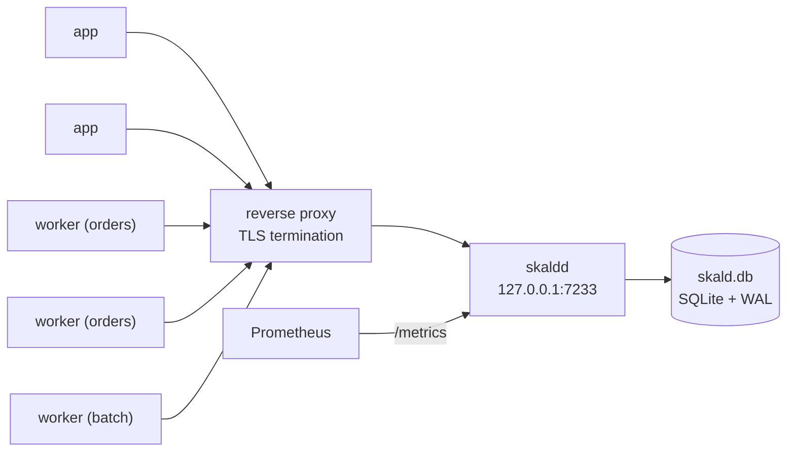

# Operating Skald

A runbook. It assumes you are either standing up `skaldd` for the first time or
looking at it at an unpleasant hour.

## Contents

- [Deployment topologies](#deployment-topologies)
- [Configuration reference](#configuration-reference)
- [Metrics that matter](#metrics-that-matter)
- [Alerts](#alerts)
- [Diagnosing a stuck workflow](#diagnosing-a-stuck-workflow)
- [Responding to a non-determinism incident](#responding-to-a-non-determinism-incident)
- [Deploying workflow code safely](#deploying-workflow-code-safely)
- [Backup and restore](#backup-and-restore)
- [Capacity guidance](#capacity-guidance)
- [Shutdown behaviour](#shutdown-behaviour)

## Deployment topologies

**Skald is a single-node engine.** Run exactly one `skaldd` per store. The write
path is replica-safe, but matching is process-local — a task dispatched inside
one `skaldd` can only be polled from that `skaldd` — so a second replica would
strand work. See the limitations section of the [README](../README.md).

### 1. Embedded, no server

For tests, single-binary tools and local development. `api.Service` is
implemented by the engine, so a worker can be pointed straight at it:

```go
store, _ := sqlite.Open(ctx, "./skald.db")
eng, _ := engine.New(engine.Config{Store: store})
_ = eng.Start(ctx)
w := worker.New(eng, "orders", worker.Options{})
```

No HTTP, no network, no second code path. This is what makes the integration
tests real tests rather than mocks.

### 2. One server, N worker processes

The normal production shape.



Requirements:

- **Terminate TLS at the proxy.** `skaldd` has no TLS listener.
- **Set `--auth-token`** and give it to every client and worker.
- **The proxy's idle timeout must exceed `--max-poll`.** 50s poll against a 60s
  idle timeout is the default relationship; if your proxy is more aggressive,
  lower `--max-poll` to stay at least ten seconds under it.
- **Do not put a request timeout below `--max-poll` in the proxy** on the two
  poll paths and on `/api/v1/workflows/history`.
- **Keep the store on local disk.** SQLite over NFS is a way to corrupt a
  database.

### 3. Separate activity workers

Activities that need different hardware (a GPU, a large heap, a VPC peering) get
their own task queue and their own process:

```go
worker.New(c, "gpu-inference", worker.Options{DisableWorkflowWorker: true})
```

The workflow schedules onto that queue with
`workflow.WithActivityOptions(ctx, workflow.ActivityOptions{TaskQueue: "gpu-inference"})`.

### 4. Local development stack

`docker-compose.yml` in the repository root brings up `skaldd`, Prometheus and
Grafana with a provisioned dashboard:

```bash
docker compose up -d
# skaldd    http://localhost:7233
# Prometheus http://localhost:9090
# Grafana    http://localhost:3000  (admin / admin)
```

## Configuration reference

Resolution order, highest priority first:

1. **Command-line flags** — but only the ones actually given. A flag left at its
   default does not beat an environment variable.
2. **Environment variables** (`SKALD_*`) — what a container runtime, a systemd
   unit or a secret manager writes to.
3. **The JSON config file** named by `--config` or `SKALD_CONFIG`.
4. **Built-in defaults.**

The effective configuration is logged at startup as one line, with the auth
token redacted. That line answers "which of the four places this could be set
actually won" without anyone reconstructing it from a deployment manifest.

| Flag | Environment | Config key | Default | Meaning |
| --- | --- | --- | --- | --- |
| `--config` | `SKALD_CONFIG` | — | *(none)* | Path to a JSON config file |
| `--version` | — | — | — | Print version and exit |
| `--addr` | `SKALD_ADDR` | `addr` | `127.0.0.1:7233` | Listen address. Loopback by default so an unauthenticated engine is not reachable by accident |
| `--namespace` | `SKALD_NAMESPACE` | `namespace` | `default` | Namespace applied to requests that omit one |
| `--store` | `SKALD_STORE` | `store` | `memory` | `memory` or `sqlite`. **`memory` loses everything on restart** and logs a warning at startup |
| `--sqlite-path` | `SKALD_SQLITE_PATH` | `sqlite_path` | `skald.db` | Database file when `--store=sqlite` |
| `--log-level` | `SKALD_LOG_LEVEL` | `log_level` | `info` | `debug`, `info`, `warn`, `error` |
| `--log-format` | `SKALD_LOG_FORMAT` | `log_format` | `json` | `json` or `text`. Logs go to **stderr** |
| `--auth-token` | `SKALD_AUTH_TOKEN` | `auth_token` | *(empty)* | Bearer token required on every route except `/health` and `/ready`. Prefer the environment variable; a flag is visible in `ps` |
| `--max-request-bytes` | `SKALD_MAX_REQUEST_BYTES` | `max_request_bytes` | `8388608` (8 MiB) | Decoded request body cap. Larger than the 2 MiB payload cap because one request may carry several payloads |
| `--request-timeout` | `SKALD_REQUEST_TIMEOUT` | `request_timeout` | `30s` | Deadline for non-polling requests |
| `--max-poll` | `SKALD_MAX_POLL` | `max_poll_duration` | `50s` | Server-side cap on a long poll. **Must stay below the connection idle timeout (120s), checked at startup** |
| `--shutdown-timeout` | `SKALD_SHUTDOWN_TIMEOUT` | `shutdown_timeout` | `20s` | Graceful drain budget |
| `--timer-interval` | `SKALD_TIMER_INTERVAL` | `timer_interval` | `1s` | How often the durable timer index is scanned. This is your timer latency floor |
| `--gzip-threshold` | `SKALD_GZIP_THRESHOLD` | `gzip_threshold` | `1024` | Response size at which gzip kicks in |
| `--runtime-metrics` | `SKALD_RUNTIME_METRICS` | `runtime_metrics` | `true` | Export Go runtime and process collectors |

A config file uses the same keys, with durations as strings so a reviewer can
read them:

```json
{
  "addr": "0.0.0.0:7233",
  "store": "sqlite",
  "sqlite_path": "/var/lib/skald/skald.db",
  "log_level": "info",
  "request_timeout": "30s",
  "max_poll_duration": "50s",
  "timer_interval": "1s"
}
```

Every field in the file is optional. An absent field does **not** erase a value
set in the environment — the classic configuration-merge bug — and an unknown
key is an error rather than a silent typo.

Invalid configuration fails at **startup**, not at the first request: a server
that boots broken and then refuses traffic is indistinguishable from a server
with a bug, and it has already been added to the load balancer by then.

### `skaldctl`

| Flag | Environment | Default |
| --- | --- | --- |
| `--address` | `SKALD_ADDRESS` | `http://127.0.0.1:7233` |
| `--namespace`, `-n` | `SKALD_NAMESPACE` | `default` |
| `--auth-token` | `SKALD_AUTH_TOKEN` | *(empty)* |
| `--timeout` | — | `30s` (long polls exempt) |
| `--output`, `-o` | — | `table`; `json` for anything scripted |
| `--color` | — | `auto` (never in a pipe) |

Exit codes are part of the contract: `0` success, `1` the command failed
(bad arguments, unreachable server, no such workflow), `2` **the workflow
failed** while the command worked perfectly. A deploy script can retry `1` and
page on `2`.

### Worker tuning

Set on `worker.Options`, not on the server.

| Option | Default | When to change it |
| --- | --- | --- |
| `MaxConcurrentActivityTasks` | 64 | **The one worth tuning.** This is what protects a downstream dependency |
| `MaxConcurrentWorkflowTasks` | 64 | A memory bound, not a CPU one. Workflow code should be fast |
| `ActivityTaskPollers` / `WorkflowTaskPollers` | 2 | More pollers cut dispatch latency on bursty queues, at one idle connection each. Automatically clamped to the corresponding concurrency limit |
| `StickyCacheSize` | 512 | Larger means fewer cold replays. Correctness never depends on a hit |
| `DisableStickyCache` | false | Trades CPU for memory. Also how the test suite proves the cache is only an optimisation |
| `DeadlockDetectionTimeout` | 5s | Keep it **below** the server's workflow task timeout (10s) so the worker's specific diagnosis wins the race against the server's "worker never came back" |
| `Identity` | `<hostname>@<pid>` | Leave it. It is what the engine's ownership check uses and what you will grep for |

## Metrics that matter

Prometheus exposition at `GET /metrics`. It is **authenticated** when
`--auth-token` is set; give your scraper a bearer token.

### Request path

| Metric | Type | Labels |
| --- | --- | --- |
| `skald_requests_total` | counter | `operation`, `code` |
| `skald_request_errors_total` | counter | `operation`, `code` |
| `skald_request_duration_seconds` | histogram | `operation` |
| `skald_poll_duration_seconds` | histogram | `operation` |
| `skald_requests_in_flight` | gauge | `operation` |

`code` is the protocol code (`ok`, `not_found`, `version_conflict`, …), not an
HTTP status. `request_duration` and `poll_duration` are separate because one
histogram cannot serve a 400-microsecond append and a 50-second poll: bucket
boundaries *are* the resolution of the metric, and a poll observed against
10-second buckets reports `+Inf` for every healthy poll — a p99 that is a flat
line no matter what the system does, which reads as "healthy".

`GetHistory` is classified per call, because the same endpoint is a 2ms read or
a 50s wait depending on one request field.

### Dispatch

| Metric | Type | Labels |
| --- | --- | --- |
| `skald_task_queue_backlog` | gauge | `namespace`, `task_queue`, `kind` |
| `skald_task_queue_pollers` | gauge | `namespace`, `task_queue`, `kind` |
| `skald_task_matches_total` | counter | `namespace`, `task_queue`, `kind`, `match` (`sync`/`async`) |
| `skald_tasks_dropped_total` | counter | `namespace`, `task_queue`, `kind`, `reason` |
| `skald_poll_timeouts_total` | counter | `namespace`, `task_queue`, `kind` |

**The sync-match ratio is the single best dispatch health signal:**

```promql
sum(rate(skald_task_matches_total{match="sync"}[5m])) by (task_queue, kind)
/
sum(rate(skald_task_matches_total[5m])) by (task_queue, kind)
```

A healthy deployment has more pollers than tasks, so nearly every match is
sync. The ratio falls when workers are saturated or absent. Poll timeouts are
*expected and healthy* when workers outnumber tasks — it is their ratio against
matches that means anything.

### Storage and workflows

| Metric | Type | Labels |
| --- | --- | --- |
| `skald_history_append_duration_seconds` | histogram | *(none)* |
| `skald_history_append_events` | histogram | *(none)* |
| `skald_history_events_total` | counter | `namespace` |
| `skald_workflow_completions_total` | counter | `namespace`, `status` |
| `skald_activity_attempts_total` | counter | `namespace`, `activity_type` |
| `skald_activity_results_total` | counter | `namespace`, `outcome` (`completed`/`failed`/`canceled`) |

`skald_history_append_duration_seconds` is measured at the API boundary, not
around the store call, so it includes decode, validation and state rebuild. That
is the number you want: "how long does it take Skald to make a change durable"
is a question about the whole path, and a store-only timer would look healthy
while a cold state cache made every write take a second.

Note two gaps, so you do not go looking for them: append duration has **no**
namespace label despite accepting one, and `skald_activity_results_total` is not
labelled by activity type, so metrics alone will not tell you *which* activity
is failing. Use logs and `skaldctl` for that.

### Retry amplification

```promql
sum(rate(skald_activity_attempts_total[5m])) by (activity_type)
/
sum(rate(skald_activity_results_total[5m]))
```

Retries increment attempts, so a value meaningfully above 1 is your retry
amplification. Above 3 sustained means a dependency is failing and you are
hammering it.

### What is deliberately not here

No metric is labelled by workflow ID, run ID, activity ID or request ID. A
Prometheus series is created per distinct label combination and lives for the
lifetime of the process plus the retention window. Labelling by workflow ID
means one series per workflow, and a deployment running a million workflows a
day creates a million series a day. The failure mode is not "the dashboard is
slow" but "the monitoring system that was supposed to tell us the engine is down
is itself down". Per-execution detail belongs in traces and logs, which are
asked for by identifier after you already know which workflow you care about.

## Alerts

Four alerts. Everything else is a dashboard.

### 1. Non-determinism (page)

```yaml
- alert: SkaldNonDeterminism
  expr: sum(rate(skald_requests_total{operation="RespondWorkflowTaskFailed"}[5m])) > 0.1
  for: 5m
  labels: { severity: page }
  annotations:
    summary: "Workflow tasks are failing; executions are wedged and not advancing"
    runbook: "docs/operations.md#responding-to-a-non-determinism-incident"
```

Why page: Skald refuses to advance an execution whose replay disagrees with its
history ([ADR 0008](adr/0008-refuse-to-advance-on-non-determinism.md)). Nothing
is lost, and nothing recovers on its own either. Affected executions stop
forever until someone acts.

The metric does not distinguish causes. Confirm with the worker logs, which name
the workflow type, the event and the mismatch.

### 2. No pollers on a queue with work (page)

```yaml
- alert: SkaldQueueUnserved
  expr: |
    skald_task_queue_backlog > 0
      and on (namespace, task_queue, kind) skald_task_queue_pollers == 0
  for: 2m
  labels: { severity: page }
  annotations:
    summary: "{{ $labels.task_queue }} has work and no workers polling"
```

Work is queued and nothing will pick it up. Usually a worker deployment that
failed, or a task queue name typo after a rename.

### 3. Store latency (ticket, then page)

```yaml
- alert: SkaldAppendSlow
  expr: histogram_quantile(0.99, sum(rate(skald_history_append_duration_seconds_bucket[5m])) by (le)) > 0.5
  for: 10m
  labels: { severity: ticket }
```

Every durable operation goes through this path. Sustained p99 above 500ms means
the disk, the page cache or the WAL checkpoint is in trouble. Above 2s, page:
workflow tasks start timing out at 10s and the system enters a retry loop.

### 4. Tasks dropped (ticket)

```yaml
- alert: SkaldTasksDropped
  expr: sum(rate(skald_tasks_dropped_total{reason="backlog_full"}[5m])) by (task_queue) > 0
  for: 5m
  labels: { severity: ticket }
```

A dropped task is delayed, not lost — it is recovered by the startup scan or by
a schedule-to-start timeout — but a queue at its 50,000-reference cap means
workers are far behind.

### Suggested thresholds

| Signal | Watch | Investigate | Page |
| --- | --- | --- | --- |
| Sync-match ratio | < 0.95 | < 0.8 | < 0.5 for 10m |
| Append p99 | > 100ms | > 500ms | > 2s |
| Non-2xx rate (excluding `not_found`) | > 0.1% | > 1% | > 5% |
| `RespondWorkflowTaskFailed` rate | any | > 0.1/s | > 0.1/s for 5m |
| Backlog depth | > 100 | > 1000 | > 10000 |
| Workflow failure ratio | 2× baseline | 5× baseline | 20× baseline |

## Diagnosing a stuck workflow

"Stuck" is one of five things. Work through them in this order.

### Step 1: what does the workflow think it is doing?

```bash
skaldctl workflow describe order-1234
```

Read three fields:

- `status` — if it is not `RUNNING`, it is not stuck; it finished and you are
  looking at the wrong problem.
- `pending_activities` — what it is waiting on. `started: true` means a worker
  holds an attempt *right now*; `started: false` with `attempt > 1` means it is
  in a retry backoff.
- `pending_timers` — `fire_at` tells you when it will wake by itself.

If both lists are empty and the status is `RUNNING`, the workflow is waiting for
a signal that has not arrived, or a workflow task is outstanding.

### Step 2: where did it stop?

```bash
skaldctl workflow history order-1234
```

The `DELTA` column is where stalls show up: the gap between the last two events
is how long it has been stuck, and the last event names what it is stuck on.

Common last events and what they mean:

| Last event | Meaning | Next step |
| --- | --- | --- |
| `WorkflowTaskScheduled` | No worker has picked up the task | Step 3 |
| `WorkflowTaskStarted` | A worker took it and has not answered | Step 4 |
| `WorkflowTaskFailed` (repeatedly) | Replay disagrees with history, or workflow code panics | [Non-determinism runbook](#responding-to-a-non-determinism-incident) |
| `ActivityTaskScheduled` | No activity worker has taken it | Step 3, with `kind=activity` |
| `ActivityTaskStarted` | An activity is running or its worker died | Step 5 |
| `TimerStarted` | It is sleeping | Check `pending_timers[].fire_at`; if that time has passed, step 6 |
| `WorkflowExecutionSignaled` | A signal arrived and no task followed | Step 6 — this should not happen |

### Step 3: is anything polling that queue?

```promql
skald_task_queue_pollers{task_queue="orders"}
skald_task_queue_backlog{task_queue="orders"}
```

Pollers at zero is the answer. Check that the worker process is running, that it
registered the right task queue name, and that it is pointed at this server.

```bash
skaldctl taskqueue describe orders
```

tells you what is on the queue by status and type, and which running execution
has been going longest. It cannot show live backlog or poller count — there is
no `DescribeTaskQueue` endpoint — so the metrics above are the authority.

### Step 4: which worker is holding the task?

The `WorkflowTaskStarted` event carries `identity`, which defaults to
`<hostname>@<pid>`. Go and look at that process.

It will resolve on its own: the workflow task's start-to-close deadline (10s by
default) fires from the timer index, `WorkflowTaskTimedOut` is appended, and a
replacement task is scheduled. If that is not happening, the timer scanner is
not running — check `skald_history_append_duration_seconds` and the server log
for `timer scan failed`.

### Step 5: is the activity alive?

Check `ActivityTaskStarted.identity` and go to that worker.

- If the activity declares a `heartbeat_timeout` and stops heartbeating, it will
  time out and retry. If it does not declare one, only `start_to_close` bounds
  it — and if `start_to_close` is generous, a hung activity hangs for that long.
- **An activity that never heartbeats can never be cancelled.** That is not a
  bug; there is no other channel through which the news could reach it.

### Step 6: is the timer scanner running?

```promql
rate(skald_requests_total{operation="RespondActivityTaskCompleted"}[5m])
```

is a poor proxy. The direct evidence is in the server log: the timer service
logs `timer scan failed` with a `consecutive_failures` count, and backs off
exponentially to 30s. If the store is failing, that is your problem, not the
workflow.

A timer whose `fire_at` has passed by much more than `--timer-interval` plus
jitter means the scanner is stalled or the store is refusing reads.

### Step 7: last resorts

```bash
# Ask it to unwind. Cooperative -- the workflow decides.
skaldctl workflow cancel order-1234 --reason "stuck, manual intervention"

# Stop it dead. No workflow code runs, so nothing is cleaned up.
skaldctl workflow terminate order-1234 --reason "unrecoverable"
```

Prefer cancel. Terminate leaves whatever the workflow was holding held.

## Responding to a non-determinism incident

### Symptoms

- `skald_requests_total{operation="RespondWorkflowTaskFailed"}` climbing,
  starting minutes after a deploy.
- Worker logs containing `workflow: non-determinism detected`.
- Executions whose history ends in repeated
  `WorkflowTaskFailed` / `WorkflowTaskScheduled` pairs.
- The number affected grows steadily, because each affected execution only fails
  when it next takes a task.

### What is happening

The deployed workflow code does not make the same decisions as the code that
wrote those histories. Skald **does not advance** the execution: it fails the
task, appends `WorkflowTaskFailed`, and schedules it again, indefinitely. No
data is lost, no compensating action runs, nothing is corrupted. Every affected
execution is frozen exactly where it was.

### 1. Read the error. It is the diagnosis.

The worker log contains something like:

```
workflow: non-determinism detected in FulfilOrder (order-1234/0f2e…) at history event 9, command 2 of the batch:
  expected (recorded in history): ScheduleActivityTask activity_id="act_2" activity_type="ReserveInventory"
  actual   (produced by replay):  ScheduleActivityTask activity_id="act_2" activity_type="CheckFraud"
  produced by: ExecuteActivity(CheckFraud)
  The workflow code running now does not make the same decisions as the code that
  wrote this history. ...
```

That names the workflow type, the execution, the history event, the position in
the command batch, the effect that was recorded, the command produced instead,
and the call that produced it. In almost every case it is enough to identify the
change in the diff without further investigation.

### 2. Roll back.

**Rolling back the worker deployment is a complete fix.** Wedged executions
resume from where they stopped, in the order they next take a task, with no data
loss and no manual repair per execution. Do this first and diagnose afterwards.

### 3. Fix forward, if rolling back is not possible.

Wrap the change in a version gate and redeploy:

```go
v := workflow.GetVersion(ctx, "fraud-check-before-reserve", workflow.DefaultVersion, 1)
if v == workflow.DefaultVersion {
    // exactly what the old code did
} else {
    // the new behaviour
}
```

Executions with no marker read `DefaultVersion` and keep taking the old branch;
new executions record `1` and take the new one. Because the task is rescheduled
indefinitely, a corrected build recovers wedged executions with no per-execution
action.

### 4. Confirm recovery.

```bash
skaldctl workflow list --status RUNNING --output json | jq '.executions | length'
skaldctl workflow describe order-1234
```

`RespondWorkflowTaskFailed` should fall to zero within a poll interval of the
rollback.

### 5. Prevent the next one.

Add a replay test to CI, using histories captured from production:

```bash
skaldctl workflow history order-1234 --json > testdata/histories/fulfil-order.json
```

```go
func TestReplayProductionHistories(t *testing.T) {
    r := worker.NewReplayer(worker.ReplayOptions{})
    r.RegisterWorkflow(FulfilOrder)
    for _, f := range must(filepath.Glob("testdata/histories/*.json")) {
        if err := r.ReplayHistoryFile(context.Background(), f); err != nil {
            t.Errorf("%s: %v", f, err)
        }
    }
}
```

Replay is entirely offline — no server, no network, no side effects — because
side effects and local activities are served from the markers already in the
history. This turns a 3am incident into a failed build.

Note that `skaldctl workflow replay <file>` is a different, weaker check: it
validates that a history file is *structurally* sound and does not run your
code. Use `worker.Replayer` for the real thing.

## Deploying workflow code safely

1. **Replay production histories in CI** before merge, as above.
2. **Deploy workers before clients** that start the new workflow type. A worker
   that receives a task for a type it does not know reports
   `UnregisteredType`, which is a deploy-ordering bug.
3. **Gate every incompatible change** with `workflow.GetVersion` — anything that
   adds, removes or reorders an activity, timer, side effect or marker.
4. **Drain before raising `minSupported`.** Only after every execution predating
   the change has closed can you raise the minimum and delete the old branch. A
   straggler then fails loudly with a specific message rather than silently
   taking the wrong path.
5. **Roll workers one at a time** and watch `RespondWorkflowTaskFailed`. The
   first affected execution appears within seconds.

## Backup and restore

### SQLite

The store runs in WAL mode. **Do not copy `skald.db` while the server is
running** — you will get a torn file that is missing the WAL. Use SQLite's own
backup, which is safe against a live database:

```bash
sqlite3 /var/lib/skald/skald.db ".backup '/backup/skald-$(date -u +%Y%m%dT%H%M%S).db'"
```

Or take a consistent snapshot of all three files together while the server is
stopped:

```bash
systemctl stop skaldd
cp /var/lib/skald/skald.db /var/lib/skald/skald.db-wal /var/lib/skald/skald.db-shm /backup/
systemctl start skaldd
```

Verify a backup before you rely on it:

```bash
sqlite3 /backup/skald-20260504T090000.db "PRAGMA integrity_check;"
sqlite3 /backup/skald-20260504T090000.db "SELECT status, count(*) FROM executions GROUP BY status;"
```

### Restore

```bash
systemctl stop skaldd
cp /backup/skald-20260504T090000.db /var/lib/skald/skald.db
rm -f /var/lib/skald/skald.db-wal /var/lib/skald/skald.db-shm
systemctl start skaldd
```

On startup the engine runs a recovery scan over every open execution and
re-materialises their pending tasks before the listener accepts traffic. The
duration is logged as `engine recovered`.

**What a restore means for correctness.** Restoring to a point in the past
un-happens every workflow event after that point — but *not* the side effects
those events described. An activity that charged a card at 09:05 is still
charged after restoring a 09:00 backup, and the workflow will schedule it again.
Activities must be idempotent; the activity ID and the scheduled event ID are
stable keys to build that on.

### Durability setting

The default is `synchronous=NORMAL` in WAL mode: a process crash, `kill -9` or
OOM loses nothing, because the log is already in the OS page cache. A power cut
or kernel panic can lose the last few committed transactions — the database is
never corrupted, but a workflow may appear to have un-happened.

That is an honest trade, because Skald acknowledges a start only *after* commit
returns, so the transactions such a crash loses are ones no client was told
about. If sudden power loss is part of your environment, open the store with
`sqlite.WithSynchronous(sqlite.SynchronousFull)` and accept roughly an order of
magnitude fewer writes per second on spinning media.

### Retention

**There is none.** Nothing is deleted, ever: no retention policy, no archival,
no delete operation on the store interface. Closed executions and their
histories accumulate until you remove them yourself.

If you write your own cleanup, delete by `closed_at` from `executions` and by
the matching `(namespace, workflow_id, run_id)` from `history_events` and
`timers`, and do it while the server is stopped or in small transactions that
cannot block the write path. Be aware that deleting a run breaks the
continue-as-new chain that `first_execution_run_id` walks.

## Capacity guidance

Skald has not been benchmarked beyond what is in
[docs/benchmarks.md](benchmarks.md). Treat everything here as a starting point
to measure from, not as a specification.

### What the bottleneck is

It is the store commit. Every mutating operation ends in one `AppendHistory`,
and on SQLite that is a WAL append. Throughput is therefore roughly
"transactions per second your disk sustains", divided by the number of history
appends per workflow.

Count the appends. A workflow with N activities costs roughly `2N + 4`
operations that each write: the start, one workflow task per decision point,
one schedule and one completion per activity, and the close. Ten activities is
around 24 store writes for the whole workflow.

### Sizing

| Resource | Rule of thumb |
| --- | --- |
| CPU | JSON encoding and history replay. One core handles a lot; the engine is not CPU bound until the store is very fast |
| Memory | Dominated by the rebuilt-state cache: 4096 executions by default, each holding its full history in memory. A 500-event history at 200 bytes per event is ~100 KB, so the cache can be several hundred megabytes for large histories |
| Disk | History size. Budget `events × (payload size + ~200 bytes)` and remember nothing is ever deleted |
| Disk IOPS | The number that matters. One fsync-class operation per mutating request under `synchronous=FULL`; far fewer under `NORMAL` |
| File descriptors | One per client connection plus 8 SQLite connections by default |

### Limits you will meet

| Limit | Value | What happens |
| --- | --- | --- |
| Payload | 2 MiB | `ErrPayloadTooLarge` at the call site |
| Request body | 8 MiB | `413` |
| History events per run | 50,000 | The run becomes **unloadable** on the next cache miss. Call `ContinueAsNew` long before this |
| Backlog per queue | 50,000 references | `429 resource_exhausted`; the task is delayed, not lost |
| State cache | 4096 executions | A miss costs a full replay |
| SQLite page size for a list | 1000 rows max | `page_size` is clamped |

### Scaling levers, in the order to pull them

1. **More activity workers.** Activities are where the wall-clock time goes, and
   they scale horizontally with no server change.
2. **Separate task queues** for work with different latency or hardware profiles,
   so a slow batch queue cannot starve an interactive one.
3. **Faster disk.** NVMe over network storage, every time.
4. **`synchronous=NORMAL`** if you were on `FULL` and can accept the trade.
5. **Shorter histories.** `ContinueAsNew` more aggressively; move chatty loops
   into activities.
6. **A bigger sticky cache** on the workers, and a bigger `StateCacheSize` on the
   server, if you see replays dominating.

There is no lever 7. Beyond one machine, Skald needs a networked store driver
and a cross-process matching design, neither of which exists.

## Shutdown behaviour

On `SIGINT` or `SIGTERM`, in order:

1. **`/ready` starts failing immediately.** A load balancer stops sending new
   work while this process can still serve what it already accepted. This is the
   step that makes a rolling restart invisible to clients.
2. **Parked long polls are released.** A worker blocked in a 50-second poll is
   not "in flight" in any meaningful sense; cancelling turns a 50-second drain
   into a millisecond one, and each worker simply re-polls somewhere else.
3. **In-flight requests are drained**, bounded by `--shutdown-timeout` (20s).
4. **On expiry, remaining connections are closed.** A request that has not
   finished in the drain window is not going to.
5. The engine stops its timer service, the store is closed, telemetry is
   flushed.

**A second `SIGTERM` kills the process immediately.** The signal handlers are
released at the start of shutdown on purpose: an operator who sends the signal
twice has decided the drain is not working, and a process that ignores its own
kill signal is worse than one that exits ungracefully.

Nothing is lost by an ungraceful exit. In-flight workflow tasks time out and are
rescheduled; in-flight activities time out and are retried; the task queues are
rebuilt by the recovery scan on the next start.

Workers drain symmetrically: `Stop` cancels polling immediately and gives
running tasks the caller's deadline (30s by default) to finish, because a
workflow task abandoned mid-flight becomes a server-side timeout and a wasted
replay. When the deadline passes, remaining tasks are cancelled and `Stop`
returns an error saying so — information a deployment system can act on rather
than a silent truncation.
